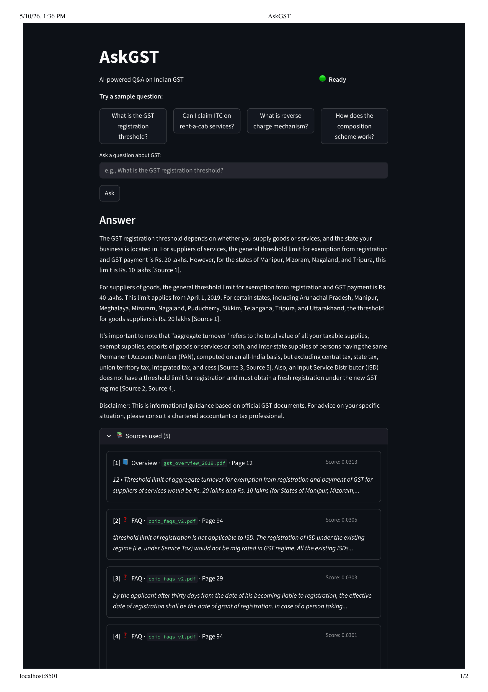
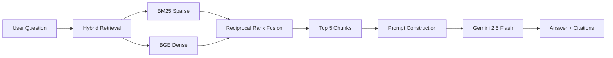

# AskGST 🧾

> Plain-English Q&A on Indian GST, grounded in official CBIC documents. Built as a portfolio project to demonstrate practical RAG engineering.

[](https://huggingface.co/spaces/pranshusinghal123/askgst)
[](docs/findings.md)
[]()



---

## What It Does

AskGST answers GST questions in plain English, with citations to specific pages of official Central Board of Indirect Taxes and Customs (CBIC) documents.

**The problem it solves.** GST law in India is fragmented across the CGST Act, IGST Act, hundreds of pages of rules, multiple FAQ books, sectoral FAQs, and rate schedules. A small business owner asking "do I need to register for GST if my turnover is 15 lakhs?" has to read across all of these to get a clear answer.

**The approach.** Hybrid retrieval (BM25 + dense embeddings) over 4,392 chunks from 13 official documents, fused via Reciprocal Rank Fusion, fed into Google Gemini 2.5 Flash with a custom prompt that enforces source-grounded citations.

### Example queries

- "Do I need to register for GST if my turnover is ₹15 lakhs?"
- "Can I claim input tax credit on rent-a-cab services?"
- "What is the time of supply for services under reverse charge?"
- "How does the composition scheme work for traders?"

---

## Demo

🚀 **[Try it live →](https://huggingface.co/spaces/pranshusinghal123/askgst)**

Free CPU tier — first query has a ~30 second cold start while models warm up; subsequent queries are fast.

## Architecture



**The pipeline in three sentences.** A user question is encoded by **BAAI/bge-small-en-v1.5** (384-dim embeddings) and searched against a **Qdrant** vector index of 4,392 GST chunks; in parallel, the same question is run through a **BM25** keyword index. Both retrievers return their top 20 candidates, which are merged via **Reciprocal Rank Fusion** (k=60). The top 5 chunks are formatted into a context block and sent to **Google Gemini 2.5 Flash** with a custom system prompt that enforces source-grounded answers with citations.

### Why hybrid retrieval?

BM25 catches exact terms like `GSTR-3B` or `Section 24` that BGE sometimes misses. BGE catches paraphrases and conceptual questions ("how does composition scheme work?") that BM25 can't match by keyword. RRF gives each retriever's ranking equal weight without privileging absolute scores — robust to differences in score scales between sparse and dense retrievers.

**Empirical validation.** On 25 hand-labeled queries with ground truth, BM25 alone achieved 48% recall@5, vector alone achieved 56%, and hybrid achieved 72%. See [findings.md](docs/findings.md) for the full eval methodology.

### Why no reranker in production?

I evaluated a `BAAI/bge-reranker-base` cross-encoder as an optional final stage. On the same 25-query eval, hybrid + reranker dropped to 64% — an 8-point regression. The cross-encoder over-weighted lexical overlap with restrictive chunks (e.g., demoting the correct rent-a-cab FAQ in favor of Section 17(5) blocked-credit lists that mentioned "rent-a-cab" verbatim). I dropped it from V1 production and documented the decision in [findings.md](docs/findings.md). The reranker code is still in the repo (`src/retrieval/reranker.py`) for V2 reconsideration on a larger eval set.

---

## Results

### Retrieval eval (recall@5 on 25 hand-labeled queries)

| Configuration         | Recall@5  | Passed    |
|-----------------------|-----------|-----------|
| BM25 only             | 48%       | 12/25     |
| Vector only (BGE)     | 56%       | 14/25     |
| **Hybrid (RRF)**      | **72%**   | **18/25** |
| Hybrid + Reranker     | 64%       | 16/25     |

The eval set has 30 queries total; 5 are deliberately included as expected-failure cases for known dataset weaknesses (fragmented rate-schedule PDFs, missing notifications, noisy form-heavy chunks) and excluded from the recall denominator. Categories cover registration, ITC, RCM, returns, composition, rate schedules, e-way bills, and exports. Phrasing styles span direct, casual, scenario-based, and paraphrased.

### Failure analysis

The 7 hybrid failures cluster into three patterns:

1. **Eval-set design limitations** (3 queries). Gold labels were too narrow. Hybrid retrieved FAQ paraphrases of the same statutory rule that legitimately answer the question; my single-chunk gold list missed them.
2. **Genuine retrieval misses** (3 queries). One was a vocabulary mismatch (query used "yearly income"; chunk used the formal "aggregate turnover"). One was a chunk-boundary failure where the answer fell across a chunk break.
3. **Multi-concept comparative query** (1 query). "Difference between exempt, nil-rated, and zero-rated supply" needs to surface 3 definitions across 3 chunks — single-gold ground truth was structurally insufficient.

The 5 expected-failure queries diagnosed real chunking issues, not retrieval issues: 4 of 5 retrieved the correct page region but the chunks themselves were unusable due to PDF table extraction breaking the rate schedules.

📄 **[Read the full findings document →](docs/findings.md)**

---

## Setup

### Prerequisites

- Python 3.11+
- Docker (for running Qdrant locally)
- A free [Google AI Studio API key](https://aistudio.google.com) (for Gemini access)

### 1. Clone and install

```bash
git clone https://github.com/pranshu2302/askgst.git
cd askgst
python3 -m venv venv
source venv/bin/activate
pip install -r requirements.txt
```

### 2. Configure environment

Create a `.env` file in the project root:

```env
GEMINI_API_KEY=your_api_key_here
```

### 3. Start Qdrant (vector database)

```bash
docker run -d --name askgst-qdrant -p 6333:6333 -p 6334:6334 \
  -v $(pwd)/qdrant_storage:/qdrant/storage qdrant/qdrant
```

### 4. Build the index (first run only)

```bash
python scripts/ingest_all.py            # generates data/processed/chunks.json
python src/retrieval/vector_store.py    # embeds chunks, uploads to Qdrant
```

This takes 2-3 minutes on a modern laptop (mostly BGE encoding 4,392 chunks).

### 5. Run the UI

```bash
streamlit run ui/app.py
```

Opens at <http://localhost:8501>.

### 6. (Optional) Run the eval harness

```bash
python src/eval/harness.py
```

Reproduces the recall@5 numbers in this README. Saves full results to `data/eval/results.json`. Run `python src/eval/analyze.py` afterwards for the per-query failure breakdown.

### Troubleshooting

- **`Connection refused` on Qdrant** — confirm the Docker container is running with `docker ps`.
- **Slow first query** — BGE and BM25 models load on first use (~600MB total). Subsequent queries are cached in memory.
- **`GEMINI_API_KEY not found`** — confirm `.env` is in the project root, not inside `src/` or `ui/`.

---

## Limitations

This is a portfolio project, not a production tax assistant. Known limitations:

- **Rate schedule queries fail.** Rate schedule PDFs use complex multi-column tables that pdf-text extraction flattens into broken chunks. Retrieval points at the right page, but the chunks themselves are unusable. V2 needs `pdfplumber.extract_tables` and a row-to-sentence transform.
- **No notifications or circulars.** I deferred CBIC notifications and circulars from the dataset because they update frequently and would need a refresh pipeline. Queries about specific notification numbers won't resolve.
- **Eval set is small.** 25 ground-truth queries is enough to show signal but wide on confidence intervals. The reranker decision (8-point regression) is suggestive, not definitive — a larger eval set is needed before reconsidering.
- **English-only.** Indian GST documents have Hindi-language sources; this project uses English-only.
- **No update mechanism.** Source documents are snapshots from late 2024. Real GST law changes frequently.

For the full V2 roadmap with priority rankings, see [findings.md](docs/findings.md).

## What this project demonstrates

- **Hybrid retrieval design** with empirical validation, not architecture for its own sake.
- **Eval-driven engineering.** Every retrieval choice (BM25+vector, RRF, no reranker) is backed by measured recall@5.
- **Honest limitations.** Documented failure modes with proposed fixes rather than glossed over.
- **End-to-end implementation.** Ingestion, chunking, indexing, retrieval, prompting, UI, eval, deployment.

---

## Tech Stack

- **LLM**: Google Gemini 2.5 Flash (`gemini-2.5-flash`, temp=0.1)
- **Embeddings**: BAAI/bge-small-en-v1.5 (384-dim)
- **Vector DB**: Qdrant (local Docker, COSINE similarity)
- **Sparse retrieval**: `rank_bm25` with custom tokenization preserving hyphens (`GSTR-3B`)
- **Cross-encoder (evaluated, not deployed)**: BAAI/bge-reranker-base
- **Framework**: LangChain core (messages, prompts) — no `RetrievalQA` chains; custom pipeline for debuggability
- **UI**: Streamlit with `st.cache_resource` pre-warming and generator-based token streaming
- **Hosting**: Hugging Face Spaces (V1 deployment)

## Repository structure

```
askgst/
├── data/
│   ├── raw/             # 13 source PDFs + 1 HTML scrape
│   ├── processed/       # chunks.json (4,392 chunks)
│   └── eval/            # results.json from latest eval run
├── src/
│   ├── ingest/          # PDF + HTML loaders, chunker
│   ├── retrieval/       # BM25, vector, hybrid (RRF), reranker
│   ├── llm/             # Gemini client + system prompt
│   ├── eval/            # harness, analyzer, query set, validator
│   └── rag.py           # end-to-end pipeline (streaming + non-streaming)
├── ui/
│   └── app.py           # Streamlit UI
├── docs/
│   ├── findings.md      # eval methodology + V2 roadmap
│   └── demo.png         # UI screenshot
├── scripts/             # ingest_all.py, test_retrieval.py
└── requirements.txt
```

## Acknowledgments

- CBIC for publishing GST documents in machine-readable formats.
- BAAI for the BGE embedding family (and reranker, even though it didn't make V1).
- The Qdrant team for an excellent local-first vector database.

## License

MIT — see `LICENSE`.

---

Built by [Pranshu Singhal](https://github.com/pranshu2302) as a portfolio demonstration of RAG engineering. Not a substitute for professional tax advice.